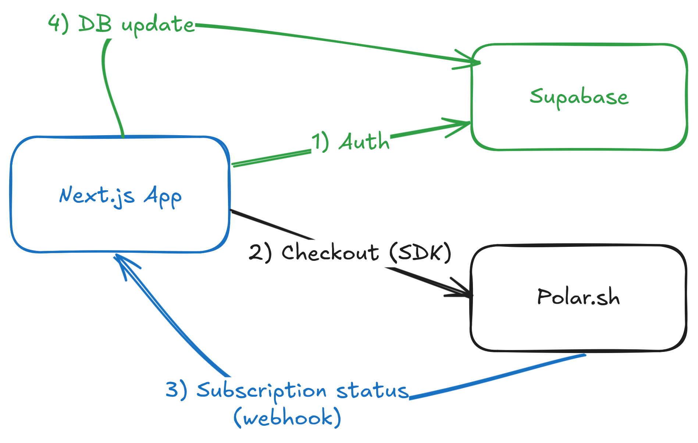

# Dodo Payments Assignment - Next.js + Supabase + Polar.sh

[*Live Demo*](https://arshan-dodo-assignment.vercel.app/)

A tiny-but-complete boilerplate for **plug-and-play subscriptions** using:

- **Next.js 15** (App Router, Server Actions)
- **Supabase** (Auth + Postgres)
- **Polar** (payments & subscriptions)
- **TypeScript-first**, minimal UI, clean module boundaries

> Swap the **`.env`** values and you’re off to the races.

---
<p align="left">
  
</p>

## Assumptions
- One Supabase user = one Polar customer.  
- Single `POLAR_PRODUCT_ID` supported.  
- Webhooks assumed reliable + idempotent (simple upsert).  
- Minimal UI (auth + subscribe + cancel).  
- Supabase chosen, but flow portable to Firebase.  
- Boilerplate designed to be reusable by swapping `.env` only.  


## Trade-offs
- Picked Polar (clean API + Experience with it) over Stripe/Razorpay (ecosystem).  
- Single `billing_subscriptions` table (no normalization).  
- No webhook retry/backoff, just signature verify + upsert.  

## Time Spent
- Project setup and Initialization: ~2h  
- Auth + checkout + webhooks: ~5h  
- Schema + testing (ngrok): ~2h  
- Docs + polish: ~2h  
**Total: ~11h**


## Setup

### 0) Prerequisites

- A Supabase project
- A Polar account (use **Sandbox** for testing)
- An IDE 

### 1) Clone & install

```bash
git clone https://github.com/ArshanKaudinya/dodo-assignment
cd dodo-assignment
npm i
```

### 2) Create `.env`

Copy this into **`.env`**:

```env
# ---- Supabase ----
NEXT_PUBLIC_SUPABASE_URL=your_supabase_url
NEXT_PUBLIC_SUPABASE_ANON_KEY=your_supabase_anon_key
SUPABASE_SERVICE_ROLE_KEY=your_service_role_key

# ---- Polar ----
# Use a Polar *Organization Access Token* for the same environment (sandbox or prod)
POLAR_ACCESS_TOKEN=polar_org_xxx
POLAR_PRODUCT_ID=your_polar_product_id
POLAR_WEBHOOK_SECRET=whsec_xxx      

# Where to bounce back after checkout (local dev or prod)
APP_URL=http://localhost:3000

# Optional: “production” uses api.polar.sh; otherwise sandbox-api.polar.sh
# POLAR_SERVER=production # for prod environments
```

> **Important:** Tokens must match environment.  
> If you use a **sandbox** product, also use a **sandbox** token & base URL.

### 3) Create the database tables

Run this SQL in Supabase (SQL editor):

```sql
create table if not exists public.billing_subscriptions (
  id text primary key,
  user_id uuid not null,
  product_id text,
  product_name text,
  status text check (status in ('trialing','active','past_due','canceled','unpaid','revoked','paused')),
  started_at timestamp with time zone,
  current_period_start timestamp with time zone,
  current_period_end timestamp with time zone,
  canceled_at timestamp with time zone,
  cancel_at_period_end boolean default false,
  created_at timestamp with time zone default now(),
  updated_at timestamp with time zone default now()
);
```

### 4) Run the app

```bash
pnpm dev
# open http://localhost:3000
```

### 5) Webhooks (dev)

Use [ngrok](https://ngrok.com/) or similar:

```bash
ngrok http 3000
```

Then in Polar dashboard, configure webhook URL:

```
https://<yours>.ngrok-free.app/api/polar-webhook
```

Paste the webhook secret in `.env.local` (`POLAR_WEBHOOK_SECRET`).

---

## Usage

- Sign up/login with email+password at `/login`.
- Go to `/` (account page).
- Hit **Subscribe** → redirect to Polar checkout → return to `/success`.
- Webhook fires → subscription row upserts into `billing_subscriptions`.
- Cancel subscription → webhook updates status.

---
